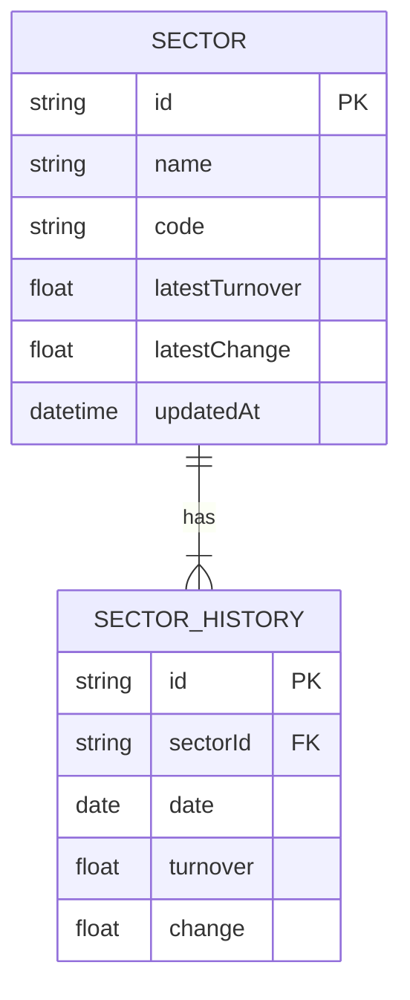

## 1. Architecture Design
```mermaid
graph TD
    A[Frontend React] --&gt;|API Calls| B[Backend Express]
    B --&gt;|CRUD| C[JSON File Storage]
    B --&gt;|Web Scraping| D[Eastmoney Website]
```

## 2. Technology Description
- Frontend: React@18 + TypeScript + tailwindcss@3 + Vite + Chart.js
- Backend: Express@4 + TypeScript
- Storage: JSON file for data persistence
- Web Scraping: axios + cheerio

## 3. Route Definitions
| Route | Purpose |
|-------|---------|
| / | 数据看板首页 |
| /sector/:id | 板块详情页 |
| /analysis | 关系分析页 |

## 4. API Definitions
```typescript
// 板块基本信息
interface Sector {
  id: string;
  name: string;
  code: string;
  latestTurnover: number;
  latestChange: number;
}

// 板块历史数据
interface SectorHistory {
  sectorId: string;
  data: Array&lt;{
    date: string;
    turnover: number;
    change: number;
  }&gt;;
}

// API Endpoints
// GET /api/sectors - 获取所有板块列表
// GET /api/sectors/:id - 获取单个板块详情
// GET /api/sectors/:id/history - 获取板块历史数据
// POST /api/scrape - 触发数据爬取
```

## 5. Server Architecture Diagram
```mermaid
flowchart LR
    A[Controller] --&gt; B[Service]
    B --&gt; C[Repository]
    C --&gt; D[JSON Storage]
    B --&gt; E[Scraper]
    E --&gt; F[Eastmoney]
```

## 6. Data Model
### 6.1 Data Model Definition


### 6.2 Data Storage Format
使用 JSON 文件存储数据，格式如下：
```json
{
  "sectors": [
    {
      "id": "1",
      "name": "银行",
      "code": "BK0465",
      "latestTurnover": 1.5,
      "latestChange": 0.5,
      "updatedAt": "2024-01-01T00:00:00Z"
    }
  ],
  "history": {
    "1": [
      {
        "date": "2024-01-01",
        "turnover": 1.5,
        "change": 0.5
      }
    ]
  }
}
```
